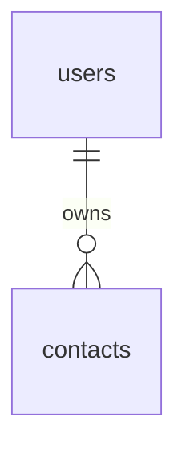

# Contact manager database

The schema targets MySQL 8.4 and matches the queries in `php/auth/` and
`php/contacts.php`. Each contact belongs to exactly one user. The API gets
`user_id` from the authenticated session, not from the request body.

## Setup

Select the `contact_manager` database and run these files in order using the
connection instructions in [the AWS handoff](../docs/aws-setup.md):

1. `schema.sql` creates the tables, constraints and indexes.
2. `seed.sql` optionally adds the demo accounts and contacts below.
3. `verification.sql` inspects the tables, relationships and partial search.

`schema.sql` can be rerun against the matching schema. `CREATE TABLE IF NOT EXISTS`
does not update existing tables. If a server already has an earlier or manually
modified schema, compare `SHOW CREATE TABLE` output and prepare a migration with
the database teammate before deploying. These files do not drop or rename tables.

Load `seed.sql` once into a fresh test database. It uses a transaction and resolves
contact owners by email rather than assuming auto-generated IDs start at 1.
Rerunning the seed is rejected by the unique account constraints. Demo credentials
are public test fixtures; do not load these accounts into a database containing
real user data.

## Users

| Column | Type | Purpose |
| --- | --- | --- |
| `id` | `INT UNSIGNED` | Auto-generated primary key used by PHP sessions |
| `username` | `VARCHAR(50)` | Required and unique |
| `email` | `VARCHAR(254)` | Required, unique login identifier |
| `password_hash` | `VARCHAR(255)` | PHP password hash; never a plaintext password |
| `created_at` | `TIMESTAMP` | Defaults to the insertion time |

## Contacts

| Column | Type | Purpose |
| --- | --- | --- |
| `id` | `INT UNSIGNED` | Auto-generated primary key |
| `user_id` | `INT UNSIGNED` | Required foreign key to `users.id` |
| `first_name`, `last_name` | `VARCHAR(50)` | Required names |
| `email` | `VARCHAR(254)` | Optional; defaults to an empty string |
| `phone` | `VARCHAR(20)` | Optional; stored as text to preserve formatting |
| `address` | `VARCHAR(255)` | Optional; defaults to an empty string |
| `notes` | `TEXT` | Optional; direct SQL may leave it null, while PHP supplies an empty string |
| `created_at` | `TIMESTAMP` | Defaults to insertion time; PHP currently supplies this explicitly |
| `updated_at` | `TIMESTAMP` | Defaults to insertion time and advances when stored values change |

Both tables use InnoDB and `utf8mb4_0900_ai_ci`, making name searches and account
uniqueness case-insensitive. `idx_contacts_user_name` supports owner filtering and
name ordering. Search still uses SQL substring matching; this index does not turn
`LIKE '%term%'` into an indexed prefix search. The foreign key rejects orphaned
contacts and prevents deleting a user while that user still owns contacts.

Database/API timestamp keys are `created_at` and `updated_at`. `date_created` is
not a database column. Timestamps and contact ownership are server-controlled.

## Demo accounts

All three accounts use the test password `ContactDemo123!`. The seed contains
bcrypt hashes generated with PHP `password_hash()` and verified with
`password_verify()`.

| Username | Login email | Contacts |
| --- | --- | --- |
| Huey | huey@example.com | Jon Doe; Joanna Jones |
| Dewey | dewey@example.com | John Jones; Mario Mario |
| Louie | louie@example.com | Chew Bacca |

Searching for `jo` as Huey should return Jon and Joanna. Searching for the same
term as Dewey should return John only. This lets the API team verify partial
matching and user isolation using separate sessions.

## Verification

After seeding, `verification.sql` should report three users, five contacts, zero
orphaned contacts, two matching contacts for Huey and one for Dewey. It is read-only
and does not print password hashes. On a database with other data, total counts
will differ.

The SQL checks complement HTTP testing: verify seeded logins, registration,
contact CRUD, and attempts by one account to read or modify another's contacts
against the configured PHP API. Run the final presentation on the remote domain.
